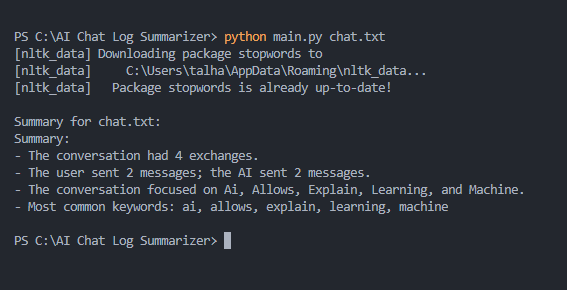

# AI Chat Log Summarizer

A lightweight Python tool that processes `.txt` chat logs between a **User** and an **AI**, generating a summary that includes message statistics, keyword extraction, and a one-line topic overview.

Developed as part of the **Junior Python Developer (AI-Focused)** task for **Qtec Solution Limited**.

---

## Features

- Parses chat logs and separates messages by speaker (`User:` vs `AI:`)
- Counts total, user, and AI messages
- Extracts top 5 keywords (via **TF-IDF** or fallback frequency method)
- Generates a one-line summary of discussion topics
- Supports analyzing a **single file** or a **folder** of `.txt` files

---

## Project Structure

```
chat-log-summarizer/
├── main.py              # Entry script to process files or folders
├── utils.py             # Core logic: parsing, stats, keywords, summary
├── chat.txt             # Sample chat file
├── requirements.txt     # Dependencies list
└── README.md            # Project overview and usage instructions
```

---

## Setup & Usage

### 1. Install Requirements

```bash
pip install -r requirements.txt
```

> Requires Python 3.7 or above

### 2. Run the Script

**To process a single chat log:**

```bash
python main.py chat.txt
```

**To process multiple chat logs in a folder:**

```bash
python main.py chat_logs/
```

---

## Sample Output

```
Summary for chat.txt:
Summary:
- The conversation had 4 exchanges.
- The user sent 2 messages; the AI sent 2 messages.
- The conversation focused on Ai, Data, Field, Learning, and Machine.
- Most common keywords: ai, data, field, learning, machine
```

## Screenshot



---

## Bonus Features Implemented

- **TF-IDF** based keyword extraction using `scikit-learn`
- Batch processing of multiple `.txt` files in a folder
- Clean and natural one-line topic summary
